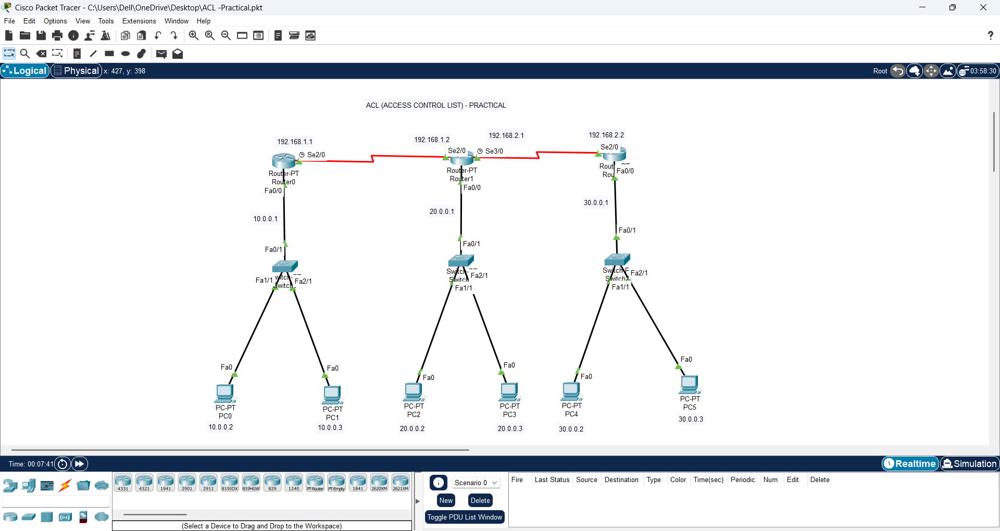

# ACL (Access Control List) - Practical

This repository contains a Cisco Packet Tracer project demonstrating the use of **Access Control Lists (ACLs)** in networking.  
The project includes routers, switches, and PCs connected in a topology where ACL rules are applied to control traffic between networks.

---

## 📂 Project Files
- `ACL -Practical.pkt` → Cisco Packet Tracer project file  
- `ACL.png` → Network topology diagram  

---

## 🔑 What is ACL?
An **Access Control List (ACL)** is a set of rules used in routers (or switches) to filter traffic.  
It decides whether to **permit** or **deny** data packets based on conditions like:
- Source IP address  
- Destination IP address  
- Protocol (TCP, UDP, ICMP, etc.)  
- Port numbers (HTTP, FTP, Telnet, etc.)  

### ✨ Types of ACL:
1. **Standard ACL** → Filters traffic using only the **source IP address**.  
2. **Extended ACL** → Filters traffic using **source, destination, protocol, and ports**.  

---

## 📌 Topology Overview
The topology has **3 routers**, each connected to its own LAN, and interconnected with serial links.

### IP Addressing Scheme
- **Router0 (LAN 1)**  
  - LAN: `10.0.0.0/24`  
  - Router IP: `10.0.0.1`  
  - PCs: `10.0.0.2`, `10.0.0.3`  

- **Router1 (LAN 2)**  
  - LAN: `20.0.0.0/24`  
  - Router IP: `20.0.0.1`  
  - PCs: `20.0.0.2`, `20.0.0.3`  

- **Router2 (LAN 3)**  
  - LAN: `30.0.0.0/24`  
  - Router IP: `30.0.0.1`  
  - PCs: `30.0.0.2`, `30.0.0.3`  

- **Serial Links (WAN Connections)**  
  - Router0 ↔ Router1: `192.168.1.1 / 192.168.1.2`  
  - Router1 ↔ Router2: `192.168.2.1 / 192.168.2.2`  

---

## 🎯 Objective
The main goals of this project are:
- To configure **ACLs** on routers.  
- To control which PCs or networks are allowed or denied communication.  
- To practice both **Standard and Extended ACLs** in Cisco Packet Tracer.  

---

## 🖼️ Network Topology


---

## 🚀 Example ACL Configurations

### Example 1: Deny PC0 (10.0.0.2) from accessing LAN 20.0.0.0/24
```bash
Router0(config)# access-list 1 deny 10.0.0.2 0.0.0.0
Router0(config)# access-list 1 permit any
Router0(config)# interface fa0/0
Router0(config-if)# ip access-group 1 out

Example 2: Deny entire LAN 30.0.0.0/24 from accessing LAN 10.0.0.0/24
bash
Copy code
Router2(config)# access-list 100 deny ip 30.0.0.0 0.0.0.255 10.0.0.0 0.0.0.255
Router2(config)# access-list 100 permit ip any any
Router2(config)# interface fa0/0
Router2(config-if)# ip access-group 100 out

📖 Learning Outcomes
Understand Standard vs Extended ACLs.

Learn how to apply ACLs on router interfaces.

Practice controlling and securing inter-network traffic.

🛠 Requirements
Cisco Packet Tracer (Version 7.3 or later recommended)

✨ Author
Created by [Kajal Kachare] for practicing ACL configuration in Cisco Packet Tracer.

